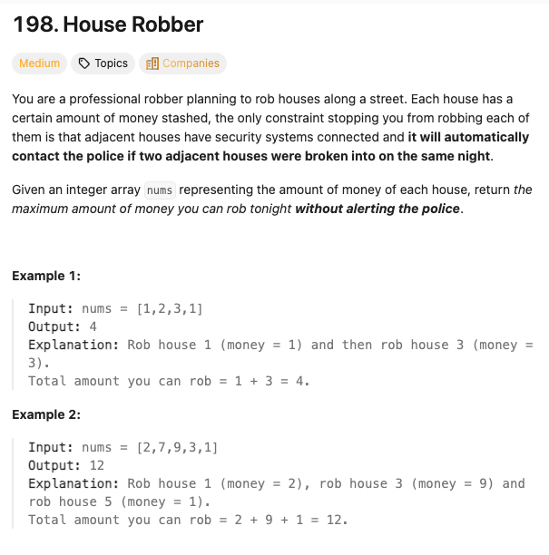

刷题日期： 2026-01-05

难度：Medium

标签：动态规划

题目截图


代码：

```python
def rob(self, nums: List[int]) -> int:
    f1 = f0 = 0
    for x in nums:
    newf = max(f1,f0+x)
    f0 = f1
    f1 = newf
    return f1
```

解题心得

- f1 定义为上一状态，f0 定义为上上状态
- newf 定义为当前状态，意思是到目前为止所偷的钱数，只需要考虑选 f1（即不偷当前家）或者选 f0（即偷当前家加上偷了上上家的状态）
